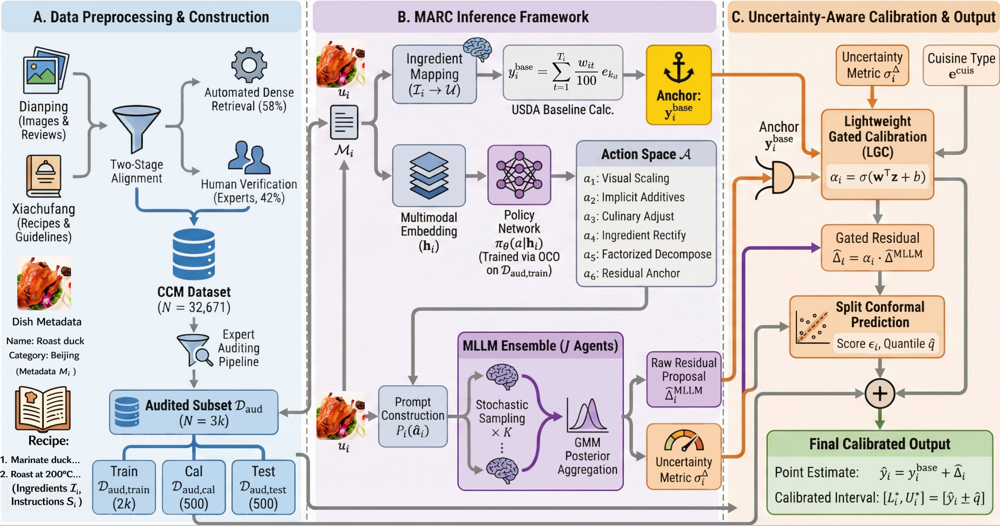

# MARC: Beyond Visual Regression for Robust Calorie Estimation

[](LICENSE)  

This repository contains the official implementation of the paper **"Beyond Visual Regression: Anchoring Multimodal Residual Correction with Domain Priors for Robust Calorie Estimation"**, submitted to **IJCAI 2026**.

## 🌟 Introduction

**MARC** reformulates calorie estimation from a direct regression task into a **conditional residual prediction** task. By grounding inference on a retrieval-based USDA anchor, MARC adaptively selects reasoning strategies to correct visual deviations.

<div align="center">
 
</div>

### Key Features
*   **Anchored Residual Learning:** Instead of predicting absolute calories, MARC predicts the deviation ($\Delta$) from a retrieved nutritional baseline.
*   **Contextual Prompt Routing:** A policy network selects the optimal reasoning strategy for different dish types.
*   **Multi-Agent Posterior Aggregation:** Mitigates MLLM hallucinations by aggregating local beliefs from an ensemble of stochastic forward passes.
*   **Reliable Quantification:** Integrates Lightweight Gated Calibration (LGC) and Split Conformal Prediction (SCP) to provide statistically valid confidence intervals.

## 🍱 The CCM Dataset

We introduce the **China Culinary Multimodal (CCM)** dataset to bridge the gap in complex, open-world food analysis. Unlike existing benchmarks dominated by discrete Western foods (e.g., Nutrition5k), CCM captures the inherent complexity of amorphous mixed ingredients and high intra-class variance across diverse regional cooking styles.

*   **Scale:** Contains over **32,000** distinct dishes with aligned images, recipes, and ingredient-level metadata.
*   **Diversity:** Spans all major regional Chinese culinary traditions (e.g., Sichuan, Guangdong, Dongbei) alongside a vast array of long-tail and international styles.
*   **Gold Standard:** Includes a High-Quality Audited Subset ($D_{aud}$) of 3,000 samples, rigorously verified by human experts for precise evaluation.

## 📁 Project Structure

```text
.
├── data/                           # Dataset directory
│   ├── input/                      # Preprocessed datasets ready for training/testing
│   │   ├── CCM.json                # Chinese Cuisine Multimodal (CCM) dataset
│   │   ├── Daud_selected_3000.json # Expert-verified Audited Subset
│   │   └── Nutrition2.7K/          # Western cuisine dataset
│   ├── output/                     # Model outputs and evaluation logs
│   └── source/                     # Raw source datasets
├── figure/                         # Generated visualization figures
├── plot/                           # Scripts for generating analysis figures
│   └── plot_action.py              # Plot for action selection frequency comparison
├── src/                            # Core source code for the MARC
│   ├── config.py                   # Global hyperparameter configurations and file paths
│   ├── data_utils.py               # Data loading, preprocessing, and CLIP embedding extraction
│   ├── modeling_marc.py            # PyTorch definitions for LGCNet and Policy Router architecture
│   ├── prompt_utils.py             # Strategy definitions and prompt construction logic
│   ├── mllm_client.py              # Qwen-VL model interface
│   ├── train_policy.py             # Stage 1: Oracle label generation and Policy Router training
│   ├── train_lgc.py                # Stage 2: Training the LGC network
│   └── inference.py                # Stage 3 & 4: Split Conformal Prediction calibration and evaluation
├── run_pipeline.py                 # Main entry point for executing Stages 1–4.
├── download_model.py               # Helper script to download base LLMs
└── requirements.txt                # Python dependencies
```

## ⚙️ Setup & Installation

The implementation is optimized for two **NVIDIA RTX PRO 6000 (96GB) GPUs** running **Ubuntu 20.04** with **Python 3.10** and **PyTorch 2.1.2**, and uses **Qwen2-VL** as the backbone MLLM. 

1. **Create Environment**
    ```bash
    conda create -n marc python=3.10
    conda activate marc
    pip install torch==2.1.2 --index-url https://download.pytorch.org/whl/cu118
    pip install -r requirements.txt
    ```

2. **Model Preparation**
    Place your base MLLM weights in the cache directory:
    ```bash
    mkdir -p model_cache/qwen/Qwen2-VL-7B-Instruct
    ```

## 🚀 Usage

### 1. Download Base Model
Download the base MLLM using our helper script:
```bash
python download_model.py
```

### 2. Running the MARC Pipeline
Running the MARC pipeline:

```bash
python run_pipeline.py
```

## 🔬 Reproducibility

*   **Code:** All code used for data collection, MARC pipeline, and evaluation is included. 
*   **Data:** We provide the China Culinary Multimodal dataset (`CCM.json`) used in our main experiments. Additionally, data loading and preprocessing scripts (e.g., `src/data_utils.py`) are included to align raw multimodal inputs with the model requirements.
*   **Hyperparameters:**  Key hyperparameters are documented in the python scripts and the paper appendix. 

## 🖋️ Citation

If you use MARC or the CCM dataset in your research, please cite:

```bibtex
@inproceedings{marc2025,
  title={Beyond Visual Regression: Anchoring Multimodal Residual Correction with Domain Priors for Robust Calorie Estimation},
  author={Anonymous},
  booktitle={Under Review},
  year={2026}
}

```


